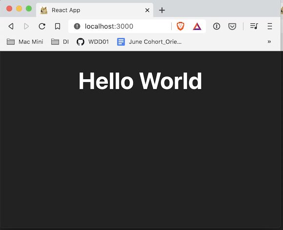
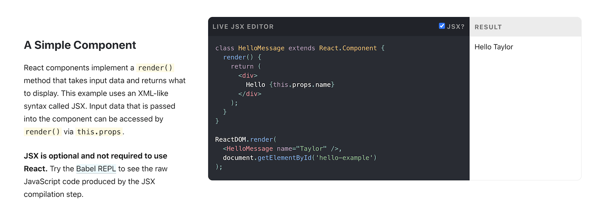
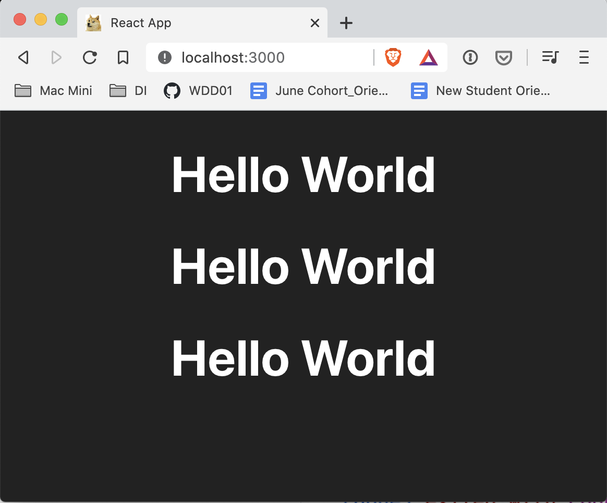
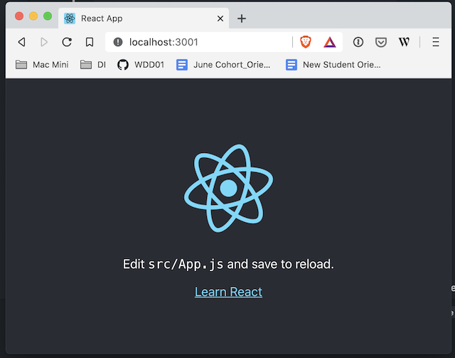

# 01 Exercise - React 'Hello World'

Render a React App, and create a custom React component

---

## Brief

In this exercise, you will work through examples of rendering a UI onto a webpage, working your way up from vanilla JavaScript, to a React component using the templating language called `JSX`.



## Rationale

Thinking in components is a critical foundation for understanding React. In this exercise, you will understand how to render a React app to a webpage, and how to build custom React components.

---

## Getting Started

1. `clone` to your local computer.
2. Follow the setup instructions in Part A

**Important:** This code for this exercise goes in `src/index.js`

---

## Exercise Part A - Setup your React development environment

React is different from the JavaScript you have been writing so far, as it uses a special templating language called `JSX`. Because of this, it requires a particular development environment. As a beginner, it's easy to be overwhelmed when setting up all the tools required for a React development environment. For today's exercise, we have already provided you with this environment.

To start the development server, navigate to the root folder of this exercise via your terminal. You can do this by opening the terminal in VS Code. Once you have the terminal ready, type the following commands:

```bash
# install the server dependencies
npm install

# start the webserver
npm start
```

Once the server starts running it should automatically open your browser to the following site: [http://localhost:3000](http://localhost:3000)

If everything has worked properly, you should see a black screen, with no content.

## Exercise Part B - Render a UI using the DOM in JavaScript

To gain an understanding of how React works, let's start with the non-react way of rendering a User Interface (UI) to a webpage.

### Understand the file structure

1. Open `public/index.html` in VS Code. You should be able to find `<div id="root"></div>`. This is the HTML element that you will render our UI into.
2. Open `src/index.js`. Find the comment that says `// Part B Exercise code below`. You will start writing our code below this comment.

### Create the UI in JavaScript

1. You are ready to start writing our UI. In `src/index.js`, start by getting a reference to the `div` element in the HTML page. It has the `id` of `root`. Create a new constant variable called `rootElement`, and find it using `querySelector` in JavaScript:

   ```js
   const rootElement = document.querySelector("#root");
   ```

2. You want to render an element into this `rootElement`. Create a new constant variable called `element`. Then create a new `h1` element in JavaScript using the [createElement](https://developer.mozilla.org/en-US/docs/Web/API/Document/createElement) method. You should end up with this:

   ```js
   const rootElement = document.querySelector("#root");
   const element = document.createElement("h1");
   ```

3. Give the `element` some text. In the line below where `element` is declared, use the [textContent](https://developer.mozilla.org/en-US/docs/Web/API/Node/textContent) method (especially read up on the differences between `textContent` vs `innerText` and `innerHTML`) to make the text `Hello World`. Your code should now look like this:

   ```js
   const rootElement = document.querySelector("#root");
   const element = document.createElement("h1");
   element.textContent = "Hello World";
   ```

4. Now use [appendChild](https://developer.mozilla.org/en-US/docs/Web/API/Node/appendChild) to render the new `element` into the `rootElement`.

   ```js
   const rootElement = document.querySelector("#root");
   const element = document.createElement("h1");
   element.textContent = "Hello World";
   rootElement.appendChild(element);
   ```

5. All things going well, you should have `Hello World` showing on your webpage.

   

Have a good look through the code you just wrote. Make sure you understand it. What is it doing?

In summary, the code you wrote is doing the following:

- Get an HTML element from the HTML page. In our example, this is `<div id="root"></div>`
- Build a new element in JavaScript. You built an `h1` element with the text `Hello World`
- Append the new element to `<div id="root"></div>`

## Exercise Part C - Render a UI using React `createElement`

You will do the same exercise using React.

1. Comment out the code from the previous part of the exercise, **but** leave `const rootElement = document.querySelector("#root");`, as you will be reusing it.
1. You will now create the HTML element using `React.createElement` and assign it to a constant variable called `element`. It uses a different API to vanilla JavaScript.

   - The first parameter of [createElement](https://reactjs.org/docs/react-api.html) is the type of HTML element you want to create, e.g. `'h1'`
   - Instead of using `textContent`, `createElement` uses a property called `children`. This is passed in as a property on an object, as the second parameter.
   - Create an element using `React.createElement`. Make it an `h1`, with the text (children) `'Hello World'`

     ```js
     const rootElement = document.querySelector("#root");
     const element = React.createElement("h1", { children: "Hello World" });
     ```

1. Now render the element to the webpage, using [ReactDOM](https://reactjs.org/docs/react-dom.html). ReactDOM has a slightly different API to `appendChild`. It takes two parameters: the element to render, and the root element to render it _into_.

   ```js
   const rootElement = document.querySelector("#root");
   const element = React.createElement("h1", { children: "Hello World" });
   ReactDOM.render(element, rootElement);
   ```

1. If everything is working, you should still see `Hello World` on your webpage.

At this point, you should understand how to create a React element, and how to render it to a webpage. You should also understand how to do the same thing in normal JavaScript. If you're still struggling, try to re-read the code you wrote above, and understand what each line is trying to do.

Think about the following questions:

- If you `console.log(element)` in each of the above examples, what is different about the result on the console?
- How is a React element different from a normal Javascript HTML element?
- What are the differences between `ReactDOM.render` and `appendChild`?
- What are the similarities between `ReactDOM.render` and `appendChild`?

## Exercise Part D - Render a UI using React and `JSX`

Now you know how `React.createElement` works. Although you just went through how to use it, in reality not many people in the React community actually use `React.createElement`.

React has a templating language called `JSX`. It looks very much like `HTML`. Normally, using this syntax would not be allowed in JavaScript as it has invalid characters. However, the tools included in Create React App take JSX, and allow it to be converted from `JSX` to `React.createElement`. Magic!

Let's explore this idea a bit more. Visit the [ReactJS homepage](https://reactjs.org/), and scroll until you get to the `Live JSX Editor`



Notice there is a checkbox that says [JSX](https://reactjs.org/docs/introducing-jsx.html). If you toggle this on and off, you will notice it switches between something that looks like `HTML`, to the `React.createElement` syntax you used in the previous example. This is illustrating how `JSX` and `React.createElement` are related, and that `JSX` will be compiled into regular JavaScript.

With the understanding that `JSX` turns into `React.createElement` through some magic in Create React App, let's convert our existing code into `JSX`.

1. Comment out:
   ```js
   //const element = React.createElement("h1", { children: "Hello World" });
   ```
   You will be replacing it with `JSX`.
2. `JSX` is much like HTML, as it has opening and closing tags. To create an `h1` element, you write it as you would `HTML`
3. On a new line underneath the commented out `element` variable, create an `h1` with the text `Hello World`. Your uncommented code should look something like this:

   ```js
   const rootElement = document.querySelector("#root");
   const element = <h1>Hello World</h1>;
   ReactDOM.render(element, rootElement);
   ```

If you refresh your webpage, nothing should have changed! Except now in your code, you are using `JSX`.

## Exercise Part E - Create a custom React Component

So far, you have rendered an `h1` element using vanilla JavaScript, `React.createElement`, and `JSX`.

But imagine if you were not just limited to HTML tags that already exist, but you could create any component that you wanted? Let's do that.

1.  Comment your Part D out:

    ```js
    // const element = <h1>Hello World</h1>;
    // ReactDOM.render(element, rootElement);
    ```

2.  Create a new variable, named `Message`, that has our existing React element on it.

    - When you make a custom React component, you need to make it a function, that returns a React element.
    - It's also important to note the capital `M` in the variable name. Custom React components have to start with a capital letter, otherwise, React cannot tell if you are trying to write normal HTML or a custom component.

      ```js
      const Message = () => <h1>Hello World</h1>;
      ```

3.  Let's now make a new React element, where you can re-use our component. Just like in HTML, you have to close your component tags. You will notice `element` is wrapped in brackets.

    ```js
    const Message = () => <h1>Hello World</h1>;
    const element = (
      <>
        <Message></Message>
      </>
    );
    ReactDOM.render(element, rootElement);
    ```

4.  You should see no change to your webpage! You have rendered your first custom React component, called `Message`! 🎉
5.  JSX has some handy features, one of them is auto-closing tags. Change your `element` variable to the following:

    ```js
    const element = (
      <>
        <Message />
      </>
    );
    ```

6.  Notice how the element looks a lot like HTML. It's very easy to reason about this code now. If you wanted to add another `<Message>` component inside the `<div>`, what do you think you would do?
7.  Update your code to look like this:

    ```js
    const element = (
      <>
        <Message />
        <Message />
        <Message />
      </>
    );
    ```

    The result should look like this:

    

Congratulations, you have rendered your first React components!

## Optional exercises

### Create more components

Now you know how to create a component, try adding more components to your page.

### Use Create React App

Use [Create React App](https://create-react-app.dev/) to create your own React application.

- Follow the [quick start documentation](https://create-react-app.dev/docs/getting-started).
- Once you have the development server started, it should open the default Create React App page in your browser:

  

- So far, our examples are all using `npm` commands, however, Create React App uses another tool called `yarn` by default. You might need to use `yarn start` instead of `npm start` if you have problems starting the app
- It's helpful to read through the documentation to help find your way, for example, the [Folder structure](https://create-react-app.dev/docs/folder-structure) will help you find where to start writing your component.

---

# Submit your exercise

- [ ] Commits are pushed to GitHub

Note: There are no automated tests for this exercise
